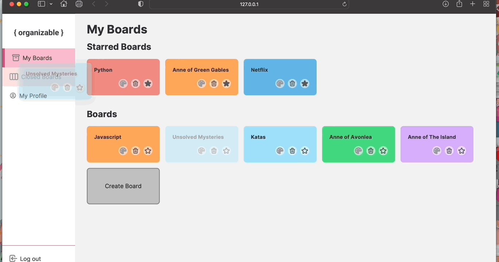
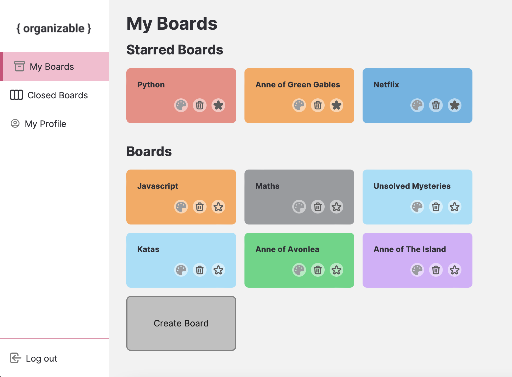
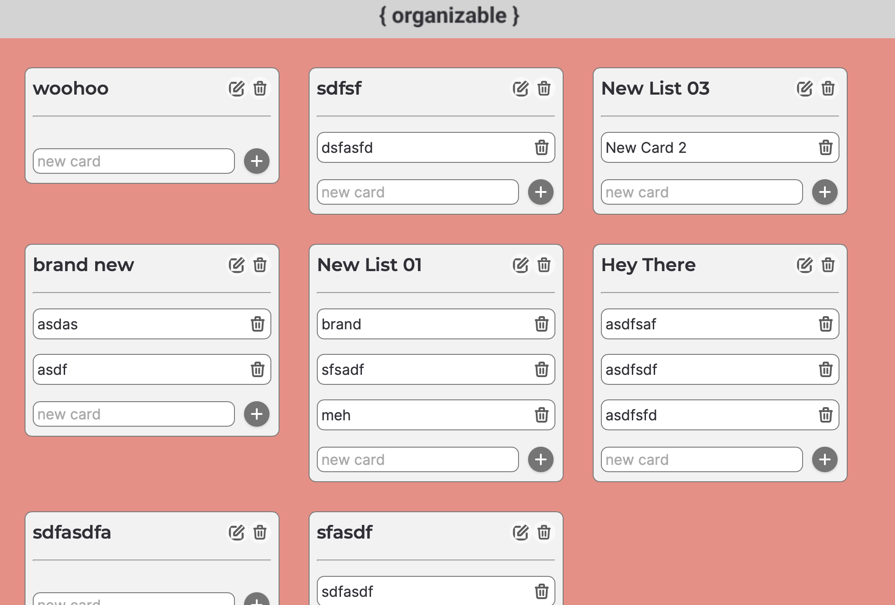
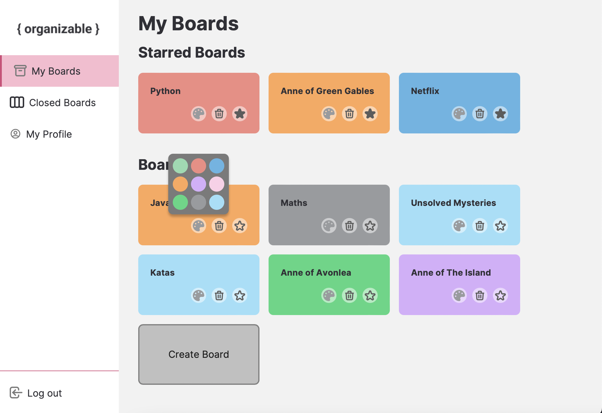
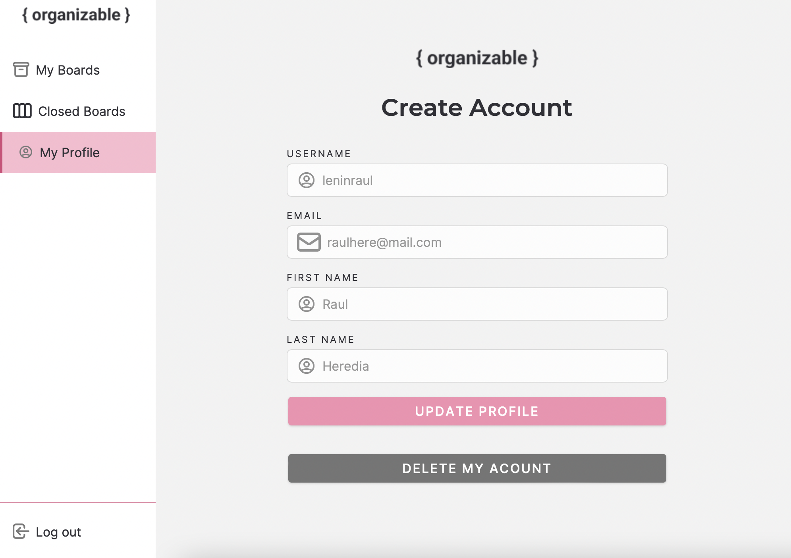

# Organizable 📇

  

### **Screenshots:**

<table>
  <tr>
    <td></td>
    <td></td>
  </tr>
  <tr>
    <td></td>
    <td></td>
  </tr>
 </table>

`Organizable` is an API client built upon Javascript that helps you organize and keep track of your projects 🔆.

`Organizable` lets you handle sets of boards, each of which includes multiple lists, which in turn contain sets of cards. 

This single-page web app was developed as part of an extended project of [Codeable](https://github.com/codeableorg) web-development bootcamp. It was specifically the final evaluation of the Javascript module 💻.

## Resources

- API endpoint: **[here](https://api-organizable.herokuapp.com)**
- Insomnia collection: **[here](./organizable-insomnia.json)**

## Features and Complexity

`Organizable` was built employing Javascript modules, DOM injection and vanilla CSS.

- 📎 User can login
- 📎 User can sign up
- 📎 User can log out
- 📎 User can edit his profile
- 📎 User can delete his account
- 📎 User can navite to home page
- 📎 User can create a new board
- 📎 User can star, unstar, close, restore and delete boards
- 📎 User can drag-and-drop boards to send them back and forth to the closed section
- 📎 User can edit a board's color
- 📎 User can see a board's lists
- 📎 User can see list's cards
- 📎 User can edit and delete lists and cards
- 📎 User can, via drag-and-drop gestures, change lists and cards order

**[Sortable](https://github.com/SortableJS/Sortable)** was employed in order to achieve the last two features.
